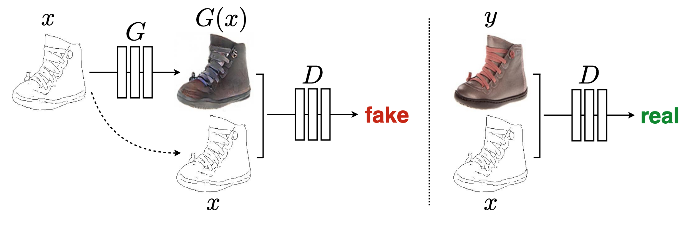

# Pix2pix

A Tensorflow 2.x implementation of Pix2pix GAN.https://arxiv.org/abs/1611.07004

Colors play a vital role in our life,  it can fill up the dullness of the picture with different senses and emotions. 

Keeping that in mind, I have designed an image colorization generative model that uses PIX2PIX GAN. Pix2Pix is a Generative Adversarial Network, model designed for general purpose image-to-image translation. For comparisons and experimental indicators the PSNR metrics is used to evaluate the performance of the proposed method. 

# Architecture


### Commands to download the data
```
wget http://data.vision.ee.ethz.ch/cvl/DIV2K/DIV2K_train_HR.zip
wget http://data.vision.ee.ethz.ch/cvl/DIV2K/DIV2K_valid_HR.zip

jar xvf  DIV2K_train_HR.zip
jar xvf DIV2K_valid_HR.zip
```

### Train the model
```
git clone https://github.com/TanyaChutani/Image-Colorization-Tf2.x.git
pip install -r requirements.txt
python train.py --epochs 100 --batch_size 16 --input_size 1024 --data_path pix2pix_data/
```

### Inferencing on images

Checkout our ` pix2pix_inference.ipynb` notebook, in order to get a gist of testing and inferencing. 

## Results


If you find this useful for your research, please use the following.
```
@InProceedings{isola2017image,
  title={Image-to-Image Translation with Conditional Adversarial Networks},
  author={Isola, Phillip and Zhu, Jun-Yan and Zhou, Tinghui and Efros, Alexei A},
  booktitle={Computer Vision and Pattern Recognition (CVPR), 2017 IEEE Conference on},
  year={2017}
}
```
